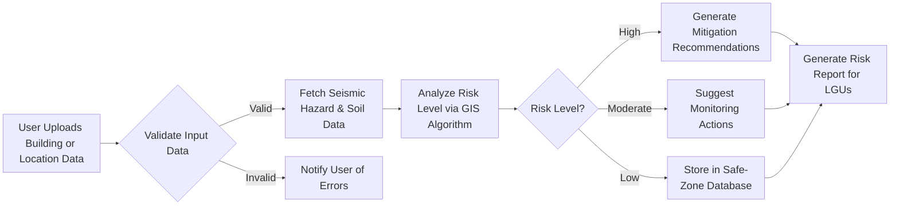

# Final-Project-Proposal

## Target Problem
In the Philippines, earthquakes are a persistent threat due to the country’s location along the Pacific “Ring of Fire.” Communities—especially in densely populated urban areas such as Metro Manila—are highly affected, because many buildings are not constructed or retrofitted according to modern seismic-resistant standards. This is a significant issue since inadequate mitigation measures can lead to massive casualties, extensive property loss, and long-term economic disruption. Strengthening mitigation strategies—such as hazard mapping, enforcing building codes, and retrofitting vulnerable structures—is crucial to reducing future damage and improving resilience (Nepomuceno, 2024).

## Existing Software Solutions
ShakeAlert® – Developed by the U.S. Geological Survey (USGS) as an early-earthquake warning system for the United States, detecting ground motion and issuing alerts when strong shaking is imminent. While its strength lies in speed and accuracy in U.S. contexts, its limitation is that it is designed for U.S. fault systems and lacks localization for the Philippines (USGS, 2022).

## Proposed Solution
EarthSafe GIS Analyzer – A web & mobile application tailored for Philippine conditions, integrating GIS layers (soil type, fault lines), local seismic history, and building-information to identify earthquake-prone zones. It assists engineers, planners, and local government units (LGUs) to make data-driven decisions (e.g., retrofitting, restricting construction in high-risk zones).

The proposed system starts when a user (engineer/planner/LGU official) uploads building or geographic data. The system validates the input, then fetches relevant geologic and seismic hazard data (including soil liquefaction susceptibility, proximity to faults). A GIS-based algorithm assesses risk level by considering factors like soil type, structural vulnerability, and occupancy type.

If risk is High → the system recommends detailed mitigation actions (e.g., retrofitting guidelines, evacuation advisories)

If risk is Moderate → the system suggests monitoring and inspection actions

If risk is Low → the site is flagged safe under current conditions and stored in a safe-zone database.
A report is generated for LGUs/planners to prioritise mitigation and budget allocation—addressing the gap that many existing solutions have: lack of localized hazard-mapping tools combined with building-data for mitigation planning.

## Application of Data Structures
The system uses a graph data structure to model spatial relationships between geographic entities—buildings, roads, fault lines, soil zones. Each node represents a location (e.g., a building or a fault segment) and each edge represents a spatial relationship (e.g., distance, adjacency, vulnerability linkage).
This graph enables efficient queries such as: “Which buildings lie within X km of a major fault?” or “What is the shortest path of vulnerability from fault zone to hospital?” By representing infrastructure and hazard‐networks as a graph, the system can rapidly analyse how seismic risk propagates through interconnected nodes—thus solving limitations of current apps that lack advanced spatial‐relationship analysis.

## References
1. Nepomuceno, P. (2024, April 8). Engineering solutions, Building Code vital in quake preparedness. Site Name. https://www.pna.gov.ph/articles/1222212
2. Earthquake Hazard Program (2022). Earthquake Early Warning - Overview. Site Name. https://www.usgs.gov/programs/earthquake-hazards/science/earthquake-early-warning-overview
